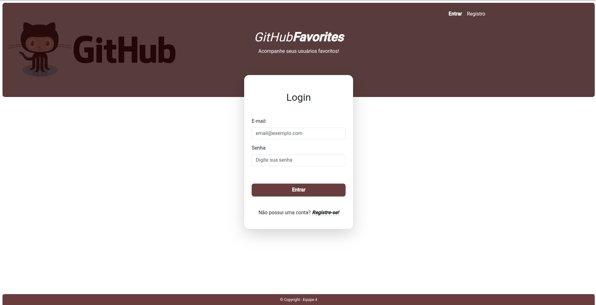

<h1 align="center">Serratec Trabalho Final - Front End Essencial</h1>
<h4 align="center">Serratec Essential Front End Final Project</h4>

This project was the final project for the essential Front End discipline in the FullStack course from Serratec. Our team worked together to create a front end project with the GitHub free API.

The program simulates a sales software where you can create, update, and delete orders. The product stock is updated after creating, updating, or removing an order, based on the ordered products. Although it is a console program, it has a user-friendly interface.

• API Fetch 
• JS element handling 
• Bootstrap 5 
• CSS 

